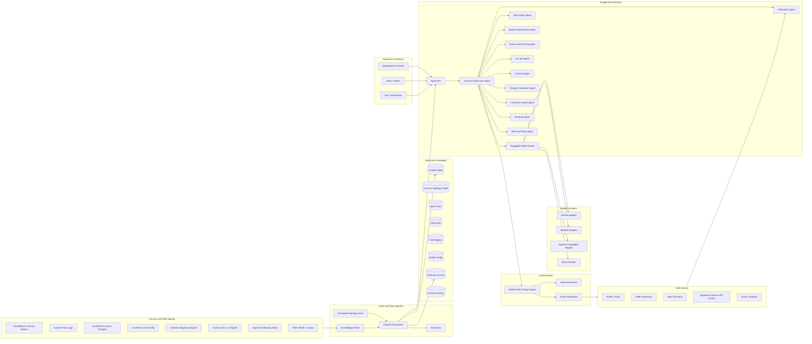
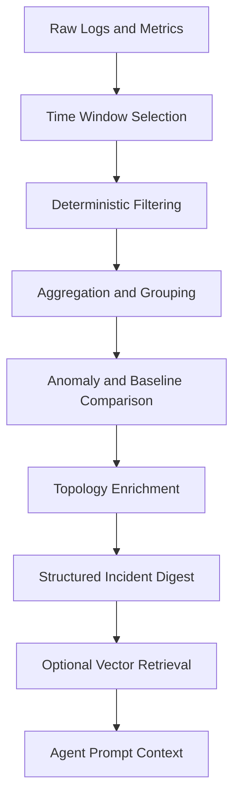
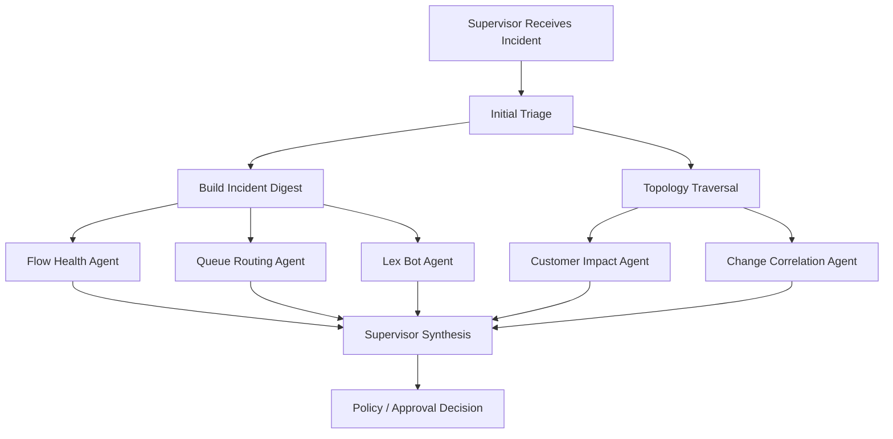

# Connect SRE Agent Specification

## 1. Purpose

Build a domain-specific **Amazon Connect SRE Agent** that monitors, understands, and assists with the operational reliability of Amazon Connect customer journeys.

This is not a generic AWS SRE bot. The generic AWS layer is only the substrate. The product is a **Connect-aware reliability supervisor** that understands contact flows, contact flow modules, queues, routing profiles, agents, Lex bots, AI agents, Lambda integrations, Contact Lens, Amazon Q in Connect, and customer journey impact.

The platform uses:

- **Google ADK Python** for supervisor/specialist-agent orchestration
- **AWS** for eventing, telemetry, storage, audit, and controlled remediation
- **A pluggable model router** supporting Gemini, Amazon Bedrock, OpenAI-compatible endpoints, and mock/test providers
- **A management console** for supervision, approvals, agent control, model routing, runbooks, topology, and audit. Features a **Demo Mode** for safe demonstration with mocked API responses.
- **Deterministic policy gates** before any write action

The central goal is to help teams detect, diagnose, explain, and safely recover Amazon Connect operational issues faster than standard dashboards and human grep archaeology. Humanity has suffered enough from manually reading flow logs at midnight.

---

## 2. Product Positioning

### 2.1 What This Is

A domain-specific operational intelligence and supervised remediation platform for Amazon Connect estates.

It continuously builds and uses an operational model of:

- Business journeys
- Entry points and channels
- Contact flows
- Contact flow modules
- Queues
- Routing profiles
- Agent groups
- Lex bots
- Lambda integrations
- AI agent integrations
- Contact Lens and Q in Connect signals
- Known runbooks
- Historical incidents
- Customer impact patterns

### 2.2 What This Is Not

- Not a generic CloudWatch chatbot.
- Not an unrestricted autonomous AWS operator.
- Not a replacement for Amazon Connect admin tooling.
- Not an agent with broad AWS write access.
- Not a production auto-remediation engine in MVP.

### 2.3 USP

The USP is **Connect operational context**.

A generic SRE agent can say:

> A CloudWatch alarm fired.

The Connect SRE Agent should say:

> ContactFlowFatalErrors increased after the Customer Verification module was updated. Three inbound journeys share this module. Queue wait time increased for Business Banking Authentication, and Lex fallback intent rate also rose. Recommended action: roll back module version or route affected entry points to the previous known-good flow after approval.

That is the product.

---

## 3. Goals

- Monitor Amazon Connect operational health across flows, modules, queues, agents, routing, Lex, Lambda, Contact Lens, Q in Connect, and related AWS services.
- Build a Connect topology graph showing dependencies between business journeys and technical resources.
- Correlate telemetry with recent configuration changes.
- Detect customer-impacting degradation early.
- Explain root cause using evidence, not model confidence theatre.
- Recommend safe remediation actions with clear blast-radius and customer-impact assessment.
- Support human approval and audit for any write action.
- Provide a supervisor console for operational control.
- Make the model provider pluggable.
- Keep Connect-specific knowledge and runbooks as reusable organisational assets.

---

## 4. Non-Goals for MVP

- No autonomous production remediation.
- No direct model-driven changes to Connect flows.
- No arbitrary AWS API execution.
- No arbitrary shell/script execution.
- No destructive actions.
- No direct customer data exposure to external models without explicit redaction and policy.
- No replacement for formal change governance.
- No cross-account write actions until single-account operation is proven.

---

## 5. Connect Resource Scope

### 5.1 Core Amazon Connect Resources

The platform should understand and inventory:

- Connect instances
- Contact flows
- Contact flow modules
- Queues
- Routing profiles
- Users / agents
- Agent statuses
- Hours of operation
- Phone numbers
- Quick connects
- Security profiles
- Prompts
- Contact attributes
- Traffic distribution groups, where applicable
- Lambda function integrations
- Lex bot integrations

### 5.2 AI and Customer Experience Resources

The platform should support or allow later extension for:

- Amazon Lex bots and aliases
- Amazon Q in Connect
- Contact Lens
- Customer Profiles
- Cases
- Knowledge bases
- Bedrock-backed AI agents
- Custom AgentCore or Lambda-hosted AI services
- Transcribe / Polly / Nova Sonic integrations where relevant

### 5.3 Supporting AWS Resources

The platform should also monitor:

- Lambda errors, throttles, and latency for flow integrations
- Lex recognition failures and fallback trends
- CloudWatch Connect metrics
- CloudWatch Logs for flow logs and Lambda logs
- CloudTrail changes for Connect, Lex, Lambda, IAM, and related services
- Service quotas and throttling indicators
- EventBridge events

---

## 6. Connect-Specific Use Cases

### 6.1 Contact Flow Regression Detection

Detect when flow errors or fatal errors increase after flow or module changes.

Signals:

- Contact flow error metrics
- Flow logs
- CloudTrail update/publish events
- Flow/module dependency map
- Increased transfers to error/fallback queues
- Abandonment increase after a specific block

Outcome:

- Identify affected journey
- Identify changed flow/module
- Estimate customer impact
- Recommend rollback or controlled failover

### 6.2 Contact Flow Module Blast Radius Analysis

When a module changes, determine which flows and journeys depend on it.

Outcome:

- List impacted journeys
- List entry points
- List affected queues
- Estimate customer contact volume at risk
- Recommend staged rollout or rollback

### 6.3 Queue and Routing Degradation

Detect queue pressure and routing anomalies.

Signals:

- QueueSize
- LongestQueueWaitTime
- MissedCalls
- Abandoned contacts
- Queue capacity exceeded
- Agent availability
- Routing profile changes
- Hours of operation changes

Outcome:

- Explain whether issue is demand, staffing, routing, upstream flow failure, or misconfiguration.

### 6.4 Lex Bot Degradation

Detect Lex fallback spikes, low confidence, failed slot capture, or alias/version changes.

Outcome:

- Identify affected bot/alias/intent
- Identify flows using the bot
- Correlate with increased transfers or abandonment
- Recommend rollback, prompt update, or route-to-agent fallback

### 6.5 AI Agent / Q in Connect Monitoring

Monitor AI-assist behaviour and customer/agent experience signals.

Signals:

- Escalation increase after AI handoff
- Agent override rates
- Knowledge retrieval misses
- Latency increase
- Safety/guardrail events
- Complaint or feedback patterns

Outcome:

- Identify degraded AI capability
- Recommend disablement, fallback, or knowledge fix

### 6.6 Observability Hygiene

Detect flows without logging enabled, missing dashboards, missing alarms, or missing runbook mapping.

Outcome:

- Raise hygiene findings
- Recommend instrumentation changes
- Track critical journey coverage

### 6.7 Change-to-Incident Correlation

Correlate symptoms to recent changes:

- Contact flow updated
- Module updated
- Lex alias changed
- Lambda alias/version changed
- Queue modified
- Routing profile changed
- Hours of operation changed
- Phone number changed
- IAM/Lambda permission changed

Outcome:

- Build timeline
- Identify likely triggering change
- Show accountable resource and owner tag

---

## 7. High-Level Architecture



---

## 8. Agent Model

### 8.1 Root Supervisor Agent

**Name:** `connect_supervisor_agent`

Responsibilities:

- Own the incident lifecycle.
- Decide which specialist agents should investigate.
- Combine technical evidence, topology, business journey context, and runbook guidance.
- Request deterministic policy decisions.
- Request approval where needed.
- Trigger safe action execution only through dispatcher.
- Produce clear operational summaries for humans.

Must not:

- Execute Connect or AWS write APIs directly.
- Invent topology or customer impact.
- Bypass approval state.
- Use unregistered tools.

---

## 9. Specialist Agents

### 9.1 Flow Health Agent

Purpose:

- Diagnose contact flow errors, fatal errors, logging issues, and block-level failure patterns.

Inputs:

- Flow metrics
- Flow logs
- Contact flow JSON
- Recent CloudTrail changes
- Flow/module topology

Outputs:

- Suspected failing flow or block
- Error trend
- Affected journey
- Missing observability
- Recommended next action

### 9.2 Module Dependency Agent

Purpose:

- Understand contact flow module dependencies and blast radius.

Outputs:

- Dependent flows
- Dependent business journeys
- Entry points at risk
- Queue/routing downstream impact
- Suggested rollback or test plan

### 9.3 Queue and Routing Agent

Purpose:

- Diagnose queue wait time, queue size, agent availability, routing profile, and hours-of-operation issues.

Outputs:

- Queue pressure cause
- Staffing/routing hypothesis
- Affected routing profiles
- Agent availability summary
- Recommended operational response

### 9.4 Lex Bot Agent

Purpose:

- Diagnose Lex fallback, intent failure, slot failure, bot alias changes, and flow integration issues.

Outputs:

- Affected bot/alias/intent
- Flows using the bot
- Recognition/fallback trend
- Recommended rollback or fallback route

### 9.5 AI Assist Agent

Purpose:

- Monitor Q in Connect, Contact Lens, Bedrock, AgentCore, or custom AI assist health.

Outputs:

- AI feature degradation
- Latency/quality/safety indicators
- Agent override or escalation patterns
- Recommended fallback

### 9.6 Change Correlation Agent

Purpose:

- Build a timeline of Connect, Lex, Lambda, IAM, and config changes before symptoms started.

Outputs:

- Candidate triggering changes
- Owner/team metadata
- Confidence score
- Evidence links

### 9.7 Customer Impact Agent

Purpose:

- Estimate customer and colleague impact.

Outputs:

- Affected channels
- Affected journeys
- Affected queues
- Estimated contact volume impacted
- Severity recommendation
- Business-facing summary

### 9.8 Runbook Agent

Purpose:

- Retrieve and validate matching Connect runbooks.

Sources:

- S3 runbook library
- Git-backed markdown runbooks
- Historical incidents
- Optional Jira/ServiceNow KB

### 9.9 Risk and Policy Agent

Purpose:

- Assess risk, blast radius, and governance notes.
- Advisory only. Deterministic policy engine decides.

### 9.10 Verification Agent

Purpose:

- Verify that remediation worked.

Signals:

- Flow errors return to baseline
- Queue metrics recover
- Lex fallback rate returns to baseline
- Lambda errors reduce
- Customer impact indicators improve

---

## 10. Pluggable Model Strategy

### 10.1 Principle

The agent framework and model provider must be separate.

The runtime supports two inference provider paths selectable at deploy time via the `MODEL_PROVIDER` environment variable:

- **`gemini`** — Google ADK (`google.antigravity`) orchestrates agents with dynamic subagent spawning (`enable_subagents=True`). Default model: `gemini-3.5-flash`.
- **`bedrock`** — AWS Strands SDK orchestrates 10 statically-registered specialist agents as tools on the supervisor. Default model: `us.anthropic.claude-sonnet-4-6`.

The model router chooses the provider/model per environment, risk class, or fallback policy. Additional supported providers (planned):

- `openai_compatible`
- `mock`

### 10.2 Model Router Interface

```python
class ModelProvider:
    async def generate(self, request: ModelRequest) -> ModelResponse:
        ...

    async def stream(self, request: ModelRequest):
        ...

    def supports_tools(self) -> bool:
        ...

    def supports_json_mode(self) -> bool:
        ...

    def provider_name(self) -> str:
        ...
```

### 10.3 Model Config Example

```yaml
modelRouting:
  defaultProvider: bedrock
  defaultModel: us.anthropic.claude-sonnet-4-6   # geo-inference ID for us-west-2
  agents:
    connect_supervisor:
      provider: bedrock
      model: us.anthropic.claude-sonnet-4-6
    flow_health:
      provider: bedrock
      model: us.anthropic.claude-sonnet-4-6
    module_dependency:
      provider: gemini
      model: gemini-2.5-pro
    verification:
      provider: mock
      model: deterministic-test-model
  fallback:
    enabled: true
    orderedProviders:
      - bedrock
      - gemini
      - openai_compatible
```

Current Bedrock model IDs (us-west-2 uses geo-inference prefixes — no In-Region support for Claude 4):

| Model | ID |
|---|---|
| Claude Sonnet 4.6 (recommended) | `us.anthropic.claude-sonnet-4-6` |
| Claude Opus 4.7 | `us.anthropic.claude-opus-4-7` |
| Claude Haiku 4.5 (fastest) | `anthropic.claude-haiku-4-5` |

### 10.4 Provider Governance

Policy may restrict model providers by:

- Environment
- Data sensitivity
- Customer data exposure
- Action risk
- Incident severity
- Regulatory posture

Production customer-sensitive incidents may require Bedrock-only routing, redaction, or internal-model-only routing.

---

## 11. Connect Topology Graph

The platform must build and maintain a Connect topology model.

### 11.1 Nodes

- Business journey
- Connect instance
- Phone number
- Channel
- Contact flow
- Contact flow module
- Queue
- Routing profile
- Agent/user
- Agent status
- Hours of operation
- Lex bot
- Lex alias
- Lambda function
- Q in Connect assistant
- Contact Lens rule/category
- Downstream service/API
- Runbook
- Owner/team

### 11.2 Edges

- `JOURNEY_ENTERS_VIA`
- `PHONE_NUMBER_STARTS_FLOW`
- `FLOW_USES_MODULE`
- `FLOW_ROUTES_TO_QUEUE`
- `QUEUE_USES_ROUTING_PROFILE`
- `ROUTING_PROFILE_HAS_AGENT`
- `FLOW_CALLS_LAMBDA`
- `FLOW_USES_LEX_BOT`
- `FLOW_USES_AI_ASSIST`
- `FLOW_HAS_RUNBOOK`
- `RESOURCE_OWNED_BY`
- `CHANGE_AFFECTED_RESOURCE`

### 11.3 Storage Options

MVP:

- DynamoDB adjacency records

Later:

- Amazon Neptune
- OpenSearch graph-like index
- S3 exported topology snapshots

MVP table: `connect-sre-topology`

Partition key: `nodeId`  
Sort key: `edgeTypeTarget`

---

## 12. AWS Infrastructure Required

### 12.1 Eventing

- EventBridge custom bus: `connect-sre-agent-bus`
- Rules for:
  - CloudWatch alarm state changes
  - CloudTrail Connect API changes
  - CloudTrail Lex API changes
  - CloudTrail Lambda API changes affecting Connect integrations
  - Security Hub / GuardDuty findings where relevant
  - Scheduled topology scans
  - Scheduled proactive health checks
- SQS DLQ

### 12.2 State

DynamoDB tables:

- `connect-sre-incidents`
- `connect-sre-approvals`
- `connect-sre-agent-runs`
- `connect-sre-policy-config`
- `connect-sre-tool-registry`
- `connect-sre-model-config`
- `connect-sre-topology`
- `connect-sre-journey-map`

S3 buckets:

- `connect-sre-evidence-{account}-{region}`
- `connect-sre-runbooks-{account}-{region}`
- `connect-sre-topology-snapshots-{account}-{region}`

### 12.3 Compute

- ADK runtime on ECS Fargate or App Runner
- Connect normalizer Lambda
- Connect topology scanner Lambda
- Action dispatcher Lambda
- Optional action-specific Lambdas
- Optional Step Functions workflows

### 12.4 Observability

CloudWatch log groups:

- `/connect-sre/runtime`
- `/connect-sre/normalizer`
- `/connect-sre/topology-scanner`
- `/connect-sre/actions`
- `/connect-sre/audit`

Metrics:

- `ConnectIncidentsCreated`
- `ConnectIncidentsResolved`
- `FlowErrorsDetected`
- `FlowRegressionSuspected`
- `QueueDegradationDetected`
- `LexDegradationDetected`
- `CustomerImpactEstimated`
- `ActionsRecommended`
- `ActionsApproved`
- `ActionsExecuted`
- `ActionsBlocked`
- `PolicyDenials`
- `ModelProviderFailures`


---

## 12A. Engineering Bottleneck: Live Connect State Graph

Connect is inherently graph-shaped. A contact centre journey is not a flat resource list. It is a directed operating graph.

Example:

```text
Business Journey
  -> Entry Phone Number / Chat Entry Point
  -> Contact Flow
  -> Contact Flow Module
  -> Lex Bot / Lambda / Q in Connect / AI Agent
  -> Queue
  -> Routing Profile
  -> Agent Group / Skill
  -> Downstream Service
```

The agent must not try to infer this graph only from raw logs during an incident. That would be slow, fragile, and frankly rude to whoever is on call.

### Requirements

The platform must maintain a live topology graph for each Connect instance.

The topology graph must support:

- Flow-to-module relationships
- Flow-to-queue relationships
- Flow-to-Lex relationships
- Flow-to-Lambda relationships
- Flow-to-Q/AI-assist relationships where available
- Queue-to-routing-profile relationships
- Routing-profile-to-agent/user relationships
- Phone-number-to-entry-flow relationships
- Business-journey-to-entry-point mappings
- Owner/team metadata
- Criticality metadata
- Last-seen timestamps
- Change timestamps
- Confidence level for inferred edges

### Traversal Use Cases

During an incident, specialist agents must query and traverse the graph to answer:

- Which business journeys use this flow?
- Which flows depend on this module?
- Which queues are downstream of this failing flow?
- Which Lex bot aliases are used by affected flows?
- Which Lambda integrations sit in the failure path?
- Which agents/routing profiles are likely affected?
- What is the blast radius of rolling back this module?
- What fallback paths exist?

### Graph Query API

Required internal APIs:

```text
GET /topology/resources/{resourceId}/upstream
GET /topology/resources/{resourceId}/downstream
GET /topology/resources/{resourceId}/blast-radius
GET /topology/journeys/{journeyId}/path
POST /topology/query
```

Example graph query:

```json
{
  "startNodeId": "connect-module:inst-123:mod-authentication",
  "direction": "downstream",
  "maxDepth": 5,
  "edgeTypes": [
    "FLOW_USES_MODULE",
    "FLOW_ROUTES_TO_QUEUE",
    "QUEUE_USES_ROUTING_PROFILE"
  ]
}
```

### Topology Freshness

The topology scanner must record:

- `lastFullScanAt`
- `lastChangeObservedAt`
- `lastSuccessfulScanAt`
- `scanSource`
- `scanConfidence`
- `staleAfterMinutes`

If topology is stale, the agent must explicitly say so and lower confidence.

---

## 12B. Engineering Bottleneck: High-Volume Logs and Context Compression

Large contact centres can produce too many logs for an LLM context window. The system must never dump raw CloudWatch log streams into a prompt.

The architecture must include a deterministic preprocessing and aggregation layer that converts high-volume telemetry into compact incident digests.

### Requirements

The platform must build structured incident digests before invoking the reasoning agents.

Digest generation must use deterministic processing first, then optional model summarisation second.

Input sources may include:

- CloudWatch Logs Insights query results
- Connect flow logs
- Lambda logs
- Lex logs/metrics
- Contact Lens summary outputs
- CloudWatch metric windows
- CloudTrail change windows
- Topology graph traversal outputs
- Recent incident history

### Digest Pipeline



### Digest Contents

A digest must include:

```json
{
  "incidentId": "conn-inc-123",
  "timeWindow": {
    "start": "2026-05-25T10:00:00Z",
    "end": "2026-05-25T10:15:00Z"
  },
  "affectedResources": [],
  "topErrors": [],
  "metricAnomalies": [],
  "changeEvents": [],
  "topologyPaths": [],
  "sampleLogLines": [],
  "droppedLogCount": 12430,
  "aggregationMethod": "cloudwatch-logs-insights",
  "confidence": 0.81
}
```

### Compression Rules

- Do not pass raw high-volume logs directly to an LLM.
- Group errors by flow, block, queue, bot, Lambda, exception type, and time bucket.
- Include only representative redacted samples.
- Preserve counts and rates.
- Preserve first-seen and last-seen timestamps.
- Preserve resource IDs and topology paths.
- Redact or hash contact IDs and customer-sensitive values.
- Store raw evidence in S3, but pass only digest references and summaries to agents.

### Optional Retrieval Layer

Later phases may add:

- Local vector search over runbooks and historical incidents
- OpenSearch indexing for structured incident retrieval
- Metric anomaly baselines
- Map-reduce summarisation where each shard is summarised independently before final synthesis

The LLM should reason over compressed evidence, not become a very expensive `grep`.

---

## 13A. Engineering Bottleneck: Safe Connect Remediation

Safe remediation must be expressed as strict, allowlisted action schemas.

The agent may propose actions. The policy engine decides if they are allowed. The action dispatcher executes only registered tools with validated parameters.

### Connect Action Classes

#### Notify / Recommend Only

Allowed in MVP:

- Create or update incident ticket
- Notify Slack/Teams
- Create customer impact summary
- Create rollback checklist
- Request topology rescan
- Request diagnostic workflow

#### Approval Required

Allowed only after approval and explicit tool enablement:

- Toggle emergency routing flag
- Switch entry point to approved fallback flow
- Roll back contact flow to known-good version
- Roll back contact flow module to known-good version
- Repoint Lex alias to previous approved version
- Disable experimental AI assist feature flag
- Trigger Lambda alias rollback for a Connect integration
- Adjust queue overflow handling using pre-approved profiles

#### Denied in MVP

- Delete flows, modules, queues, users, prompts, or security profiles
- Broad routing profile mutation
- Broad IAM mutation
- Direct model-generated contact flow JSON update
- Untested flow publish
- Any action without rollback and verification
- Any action affecting production without approval

### Safe Action Schema

Every action must use this schema:

```json
{
  "actionId": "connect_toggle_emergency_routing",
  "actionClass": "connect_control",
  "riskLevel": "medium",
  "requiresApproval": true,
  "environment": "prod",
  "target": {
    "resourceType": "business_journey",
    "resourceId": "journey-authentication"
  },
  "parameters": {
    "flagName": "bypass_lex_authentication",
    "desiredState": true,
    "ttlMinutes": 60
  },
  "preconditions": [
    "Fallback flow exists",
    "Fallback flow has been validated",
    "Customer impact is medium or higher"
  ],
  "rollback": {
    "method": "set_flag",
    "parameters": {
      "flagName": "bypass_lex_authentication",
      "desiredState": false
    }
  },
  "verification": {
    "method": "metric_recovery",
    "metrics": [
      "ContactFlowFatalErrors",
      "LongestQueueWaitTime"
    ],
    "expectedWithinMinutes": 15
  }
}
```

### Deterministic Action Validation

Before execution, the action dispatcher must validate:

- Tool exists in registry
- Tool is enabled
- Parameters match schema
- Target resource exists in topology graph
- Target environment is allowed
- Approval exists if required
- Approval has not expired
- User has required role
- Rollback method exists
- Verification method exists
- Change freeze does not block action
- Blast radius is within allowed policy

If validation fails, action is denied and the reason is audited.

---

## 13B. Incident Digest Store

Add a durable digest store so the platform can persist compressed evidence separately from raw logs.

DynamoDB table: `connect-sre-incident-digests`

Partition key: `incidentId`  
Sort key: `digestVersion`

Attributes:

- `digestType`
- `createdAt`
- `timeWindowStart`
- `timeWindowEnd`
- `sourceCount`
- `droppedLogCount`
- `rawEvidenceS3Uri`
- `digestS3Uri`
- `redactionApplied`
- `aggregationMethod`
- `modelSummarised`
- `confidence`

The agent must prefer the latest successful digest when investigating an incident.


---

## 12C. Engineering Bottleneck: DynamoDB Graph Traversal Latency

The MVP topology store uses DynamoDB adjacency records. This is acceptable for direct lookups, but recursive blast-radius traversal can become slow if implemented as sequential reads.

A module blast-radius query with `maxDepth = 5` may require multiple edge expansions across flows, queues, routing profiles, Lex bots, Lambda functions, and business journeys. During an active incident, the agent must not spend precious time politely asking DynamoDB one edge at a time like it is queuing at a post office.

### Requirements

The `TopologyService` must support low-latency traversal strategies.

MVP implementation must include at least two of the following:

1. **Parallel asynchronous edge expansion**
   - Fetch all next-hop edges for a traversal layer concurrently.
   - Apply max concurrency limits to avoid DynamoDB throttling.
   - Deduplicate nodes between layers.

2. **In-memory graph cache**
   - Load topology graph into memory at service startup.
   - Refresh on scheduled topology scan completion.
   - Refresh affected subgraphs after mutation events.
   - Track cache freshness and version.

3. **Precomputed blast-radius indexes**
   - Store common blast-radius expansions for critical modules, flows, and queues.
   - Recompute after topology changes.
   - Use for high-priority incidents.

4. **Escalation to graph-native store later**
   - If traversal latency becomes a bottleneck, move or replicate topology into Amazon Neptune or another graph-native index.

### Traversal SLA

Target for MVP:

| Query Type | Target Latency |
|---|---:|
| Direct resource lookup | < 250 ms |
| One-hop upstream/downstream | < 500 ms |
| Blast radius depth 3 | < 2 seconds |
| Blast radius depth 5 | < 5 seconds |
| Fallback with stale/cache miss | Return partial result with confidence warning |

### Cache Metadata

The topology cache must expose:

```json
{
  "cacheVersion": "topo-20260525-120000",
  "loadedAt": "2026-05-25T12:00:00Z",
  "lastFullScanAt": "2026-05-25T11:55:00Z",
  "lastPartialScanAt": "2026-05-25T12:03:00Z",
  "nodeCount": 1240,
  "edgeCount": 4821,
  "isStale": false
}
```

The agent must include topology freshness in incident summaries when relevant.

---

## 12D. Engineering Bottleneck: Event-Driven Partial Topology Refresh

A scheduled topology scan every 30 minutes is not enough. Connect changes can cause incidents minutes after a configuration update.

When a CloudTrail mutation event is received, the system must trigger a localized topology refresh for the affected subgraph.

### Mutation Events That Must Trigger Partial Refresh

- Contact flow created, updated, deleted, or published
- Contact flow module created, updated, deleted, or published
- Queue updated
- Routing profile updated
- User or agent routing association changed
- Hours of operation changed
- Phone number associated or reassigned
- Lex bot alias changed
- Lambda alias/version/configuration changed for a known Connect integration
- Q in Connect or AI assist configuration changed where detectable

### Partial Refresh Requirements

The normalizer must classify CloudTrail events as:

```text
topology_mutation
runtime_signal
security_signal
noise
unknown
```

For `topology_mutation`, the normalizer must emit a topology refresh request.

Example event:

```json
{
  "eventType": "topology_partial_refresh_requested",
  "sourceEventId": "cloudtrail-event-id",
  "resourceType": "contact_flow_module",
  "resourceId": "module-id",
  "instanceId": "connect-instance-id",
  "reason": "UpdateContactFlowModuleContent",
  "observedAt": "2026-05-25T12:03:00Z"
}
```

The topology scanner must support:

```text
POST /topology/scan
POST /topology/scan/partial
```

Partial scan behaviour:

- Refresh only affected resource and immediate neighbours where possible.
- Recompute dependent edges.
- Invalidate cache entries for affected subgraph.
- Record `lastPartialScanAt`.
- Emit audit event.
- If partial scan fails, mark affected topology as stale.

### Incident Timing Rule

If an incident occurs within 60 minutes of a Connect/Lex/Lambda mutation event, the Change Correlation Agent must check whether the topology cache reflects that mutation.

If not, it must request a partial scan before final diagnosis.

---

## 12E. Engineering Bottleneck: Multi-Agent Latency and Observability

The system uses multiple specialist agents. If invoked sequentially, response time can degrade into the 30-60 second range or worse.

The supervisor must support asynchronous worker dispatch and must trace every model/tool step.

### Parallel Dispatch Requirements

The supervisor must run independent investigations concurrently where possible.

Examples:

- Flow Health Agent and Change Correlation Agent can run in parallel.
- Queue Routing Agent and Lex Bot Agent can run in parallel if both are relevant.
- Customer Impact Agent can begin after initial topology traversal, without waiting for every RCA hypothesis.
- Runbook Agent can retrieve likely SOPs while evidence aggregation continues.

### Execution Pattern



### Latency Budget

| Stage | Target |
|---|---:|
| Normalization | < 5 seconds |
| Digest build | < 10 seconds |
| Topology traversal | < 5 seconds |
| Parallel specialist agents | < 20 seconds |
| Supervisor synthesis | < 10 seconds |
| First useful recommendation | < 45 seconds |

For critical incidents, the system should return an initial partial diagnosis before full completion if the full workflow exceeds the latency budget.

### LLM Observability Requirements

Every agent step must record:

- `agentName`
- `runId`
- `incidentId`
- `modelProvider`
- `modelId`
- `promptTemplateVersion`
- `inputTokenCount`
- `outputTokenCount`
- `latencyMs`
- `toolCalls`
- `retryCount`
- `errorType`
- `cacheHit`
- `costEstimate`
- `parentSpanId`
- `spanId`

The platform must support trace reconstruction across supervisor and specialist agents.

### Agent Run Trace Store

The existing `connect-sre-agent-runs` table must store run summaries. Detailed traces may be stored in S3 or CloudWatch Logs.

Trace record example:

```json
{
  "runId": "run-123",
  "incidentId": "conn-inc-123",
  "agentName": "flow_health",
  "spanId": "span-456",
  "parentSpanId": "span-root",
  "startedAt": "2026-05-25T12:00:00Z",
  "endedAt": "2026-05-25T12:00:04Z",
  "latencyMs": 4210,
  "modelProvider": "bedrock",
  "modelId": "amazon.nova-pro",
  "toolCalls": ["connect_flow_logs.query_digest"],
  "status": "success"
}
```

---

## 12F. Engineering Bottleneck: Missing Logs Are a Diagnostic Signal

Amazon Connect flow logs may be unavailable because logging was not enabled in the flow, because the log group is missing, because permissions are wrong, or because the incident is occurring before logs are delivered.

The absence of logs must not be treated as a tool failure by default. It is a diagnostic signal.

### Requirements

The `connect_flow_logs` tool must return structured no-data states.

Example:

```json
{
  "status": "no_logs_available",
  "reason": "flow_logging_not_enabled",
  "flowId": "flow-id",
  "logGroup": "/aws/connect/instance-id",
  "diagnosticSignal": true,
  "recommendation": "Enable Set logging behavior block for this critical flow."
}
```

Allowed statuses:

```text
ok
no_logs_available
flow_logging_not_enabled
log_group_missing
permission_denied
query_timeout
delivery_delay_suspected
unknown_error
```

Agent behaviour:

- If status is `flow_logging_not_enabled`, raise an observability hygiene finding.
- If status is `log_group_missing`, check instance logging configuration.
- If status is `permission_denied`, raise platform permission issue.
- If status is `delivery_delay_suspected`, fall back to metrics and topology.
- Do not hallucinate log evidence.
- Do not fail the whole investigation unless logs are mandatory for the selected runbook.

This is important because “no logs” is often the answer. A deeply annoying answer, but still an answer.

---

## 13. Safe Action Classes

### 13.1 MVP Actions

MVP should default to recommendation and approval. Safe actions include:

- Create/update Jira or ServiceNow incident
- Notify Slack/Teams channel
- Raise customer-impact summary
- Create rollback recommendation
- Create Connect admin action checklist
- Start SSM/Step Functions wrapper for approved diagnostics
- Re-run topology scan
- Disable low-risk alert noise rule
- Create an AWS Support case recommendation

### 13.2 Later Approved Connect Actions

Only after policy and approval maturity:

- Roll back contact flow content to a known-good version
- Roll back contact flow module content to a known-good version
- Republish approved flow/module version
- Switch phone number to fallback flow
- Update routing profile association
- Update queue capacity or operating-hours mapping
- Repoint Lex alias to previous version
- Disable experimental AI assist feature flag
- Trigger safe Lambda alias rollback for flow integration

### 13.3 Denied in MVP

- Delete Connect resources
- Broad IAM changes
- Delete flows/modules/queues/users
- Change production routing without approval
- Modify security profiles
- Modify KMS policies
- Execute arbitrary scripts
- Make model-generated flow JSON changes directly

---

## 14. Policy Engine

The policy engine is deterministic.

Inputs:

- Environment
- Incident severity
- Business journey criticality
- Customer impact estimate
- Resource type
- Resource owner
- Action type
- Tool registry entry
- Model provider policy
- Approval state
- Change freeze state
- Business hours
- Blast radius

Outputs:

- `allow_auto`
- `allow_with_approval`
- `deny`
- `escalate`

Rules:

- Production Connect write actions require approval.
- High criticality journeys require two-person approval for write actions.
- Actions affecting more than one flow/module require approval.
- Any action without rollback plan is denied.
- Any action without verification check is denied.
- Unregistered tools are denied.
- Destructive actions are denied in MVP.
- Customer-sensitive evidence must be redacted before external model providers.

---

## 15. Management Interface

### 15.1 Dashboard

- Open Connect incidents by severity
- Affected journeys
- Flow/module health
- Queue health
- Lex bot health
- AI assist health
- Pending approvals
- Recent Connect changes
- Top noisy flows/queues
- MTTA/MTTR

### 15.2 Connect Topology View

- Journey-to-flow map
- Flow-to-module dependency map
- Flow-to-queue map
- Flow-to-Lex map
- Flow-to-Lambda map
- Queue-to-routing-profile map
- Owner/team metadata
- Criticality labels

### 15.3 Incident Detail

- Timeline
- Raw event
- Affected journey
- Affected Connect resources
- Flow/module dependency blast radius
- Evidence bundle
- Recent changes
- Agent summaries
- Customer impact estimate
- Proposed action
- Risk and approval state
- Verification result

### 15.4 Approvals

- Pending remediations
- Approve/reject/escalate
- Required justification
- Two-person approval
- Approval expiry

### 15.5 Agent Control

Modes:

- `observe_only`
- `recommend_only`
- `approval_required`
- `low_risk_auto`
- `disabled`

Controls:

- Pause execution
- Disable a specialist agent
- Replay incident
- Re-run topology scan
- Cancel active investigation

### 15.6 Model Configuration

- Default provider/model
- Per-agent provider/model
- Fallback order
- Provider health
- Token/latency/error metrics
- Environment restrictions

### 15.7 Runbooks

- Flow regression runbooks
- Module rollback runbooks
- Queue degradation runbooks
- Lex rollback runbooks
- AI assist fallback runbooks
- Observability hygiene runbooks

### 15.8 Audit

- Event ingestion log
- Topology scan log
- Model call log
- Agent run log
- Tool call log
- Approval log
- Policy decision log
- Execution log

---

## 16. API Surface

```text
GET    /health
GET    /incidents
GET    /incidents/{incidentId}
POST   /incidents/{incidentId}/replay

GET    /topology
POST   /topology/scan
GET    /topology/resources/{resourceId}
GET    /journeys
GET    /journeys/{journeyId}

GET    /approvals
POST   /approvals/{approvalId}/approve
POST   /approvals/{approvalId}/reject

GET    /agents/status
POST   /agents/mode
POST   /agents/pause
POST   /agents/resume

GET    /models/config
PATCH  /models/config

GET    /tools
PATCH  /tools/{toolId}

GET    /policies
PATCH  /policies/{policyId}

GET    /runbooks
POST   /runbooks/validate

GET    /audit
```

---

## 17. Normalized Connect Incident Event

```json
{
  "schemaVersion": "1.0",
  "incidentId": "conn-inc-20260525-abc123",
  "dedupeKey": "connect:flow:error:instance:flow-id",
  "source": "aws.connect.cloudwatch",
  "accountId": "123456789012",
  "region": "eu-west-2",
  "eventTime": "2026-05-25T10:00:00Z",
  "severityHint": "medium",
  "connect": {
    "instanceId": "connect-instance-id",
    "instanceArn": "arn:aws:connect:eu-west-2:123456789012:instance/abc",
    "channel": "voice",
    "businessJourney": "Customer Authentication",
    "contactFlowId": "flow-id",
    "contactFlowModuleId": "module-id",
    "queueId": "queue-id",
    "routingProfileId": "routing-profile-id",
    "lexBotAlias": "optional",
    "lambdaFunctionArn": "optional"
  },
  "signal": {
    "type": "ContactFlowFatalErrors",
    "name": "FlowFatalErrorAlarm",
    "previousState": "OK",
    "currentState": "ALARM",
    "reason": "Threshold crossed"
  },
  "rawEventS3Uri": "s3://bucket/raw-events/...",
  "correlation": {
    "traceId": "optional",
    "contactId": "redacted-or-hashed-if-present",
    "service": "amazon-connect",
    "environment": "prod"
  }
}
```

---

## 18. Repository Structure

```text
connect-sre-agent/
  README.md
  SPEC.md
  BUILDER_PROMPT.md
  docs/
    architecture.md
    connect-topology.md
    runbook-authoring.md
    policy-model.md
    model-routing.md
    threat-model.md
  infra/
    cloudformation/
      connect-sre-agent-platform.yaml
      nested/
        security.yaml
        eventing.yaml
        state.yaml
        compute.yaml
        connect-observability.yaml
        management-ui.yaml
  agent/
    pyproject.toml
    src/
      connect_sre_agent/
        main.py
        agents/
          supervisor.py
          flow_health.py
          module_dependency.py
          queue_routing.py
          lex_bot.py
          ai_assist.py
          change_correlation.py
          customer_impact.py
          runbook.py
          risk_policy.py
          verification.py
        models/
          router.py
          providers/
            base.py
            gemini.py
            bedrock.py
            openai_compatible.py
            mock.py
        tools/
          connect_read.py
          connect_metrics.py
          connect_flow_logs.py
          connect_topology.py
          cloudtrail.py
          lex.py
          lambda_signals.py
          contact_lens.py
          notifications.py
          ticketing.py
        policy/
          engine.py
          models.py
        schemas/
          connect_event.py
          topology.py
          journey.py
          incident.py
          approval.py
          tool_registry.py
          model_config.py
        services/
          incident_store.py
          topology_store.py
          evidence_store.py
          audit_log.py
  normalizer/
    src/
      handler.py
  topology-scanner/
    src/
      handler.py
  action-dispatcher/
    src/
      handler.py
  ui/
    package.json
    src/
      pages/
      components/
      api/
  runbooks/
    flow-regression.yaml
    module-rollback-checklist.yaml
    queue-degradation.yaml
    lex-fallback-spike.yaml
    ai-assist-fallback.yaml
  tests/
    unit/
    integration/
    simulations/
```

---

## 19. Build Phases

### Phase 1: Connect Observe and Recommend

- EventBridge rules for CloudWatch and CloudTrail.
- Connect normalizer.
- Incident store.
- Topology scanner.
- ADK supervisor and specialist agents.
- Read-only Connect, CloudWatch, CloudTrail, Lex, Lambda tools.
- Model router with mock, Bedrock, Gemini, OpenAI-compatible adapters.
- Basic UI with incidents, topology, and model config.
- No Connect write actions.

### Phase 2: Approval-Based Safe Actions

- Tool registry.
- Policy engine.
- Approval workflow.
- Ticketing/notification actions.
- Safe diagnostic workflows.
- Verification agent.

### Phase 3: Approved Connect Remediation

- Flow/module rollback recommendation.
- Human-approved flow/module republish wrapper.
- Lex alias rollback wrapper.
- Queue/routing diagnostic automation.
- Contact flow observability remediation recommendations.

### Phase 4: Multi-Account / Multi-Instance / Multi-Region

- Cross-account read roles.
- Connect instance registry.
- Multi-region topology graph.
- Region/instance blast-radius controls.
- Central operations view.

---

## 20. MVP Acceptance Criteria

- CloudWatch Connect alarm creates incident within 30 seconds.
- CloudTrail Connect change creates change event and topology refresh trigger.
- Topology scanner inventories flows, modules, queues, routing profiles, users, hours, phone numbers, Lex integrations, and Lambda references where available.
- Flow error incident links to affected flow and business journey where mapped.
- Agent produces evidence-backed diagnosis and recommendation.
- Customer impact estimate is shown.
- UI shows incident, topology, recommendation, model provider, and audit.
- Model provider can be changed without code change.
- No write action can execute without registered tool and policy decision.
- Production write actions require approval.
- All model calls, tool calls, decisions, and approvals are logged.

---

## 21. Recommended MVP Decision

Build the generic SRE substrate only where needed. The product should be explicitly branded and structured as **Connect SRE Agent**.

Start with:

- `recommend_only` mode
- single AWS account
- single Connect instance
- read-only telemetry
- topology scanner
- flow regression use case
- queue degradation use case
- Lex fallback spike use case
- management console

Do not start with generic EC2/EKS remediation. That path is crowded, noisy, and will make this project look like every other alarm bot wearing a cheap moustache.
