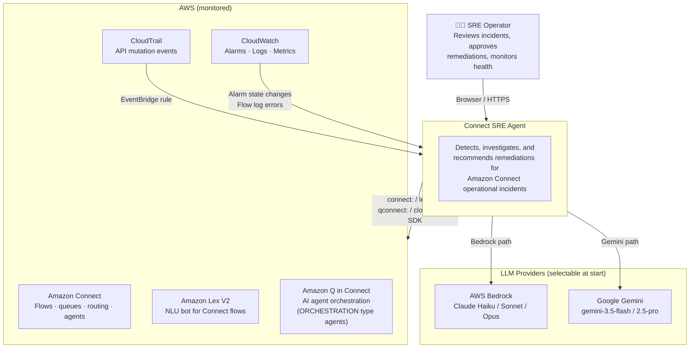
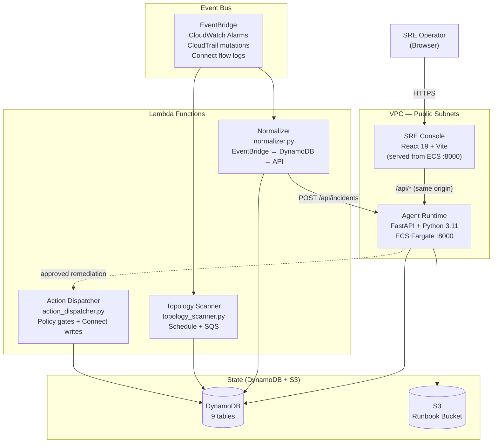
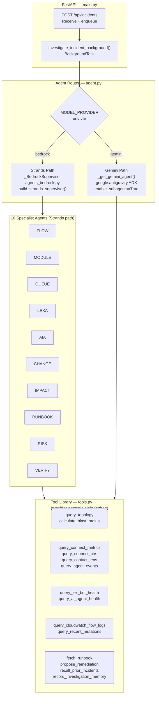
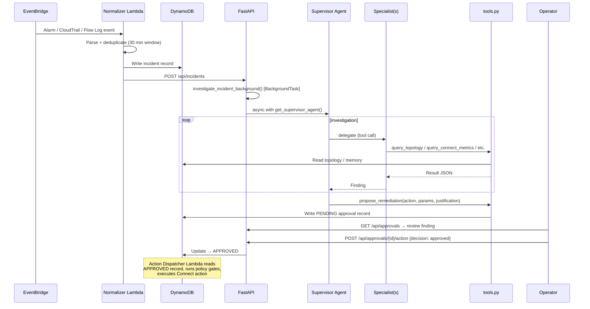
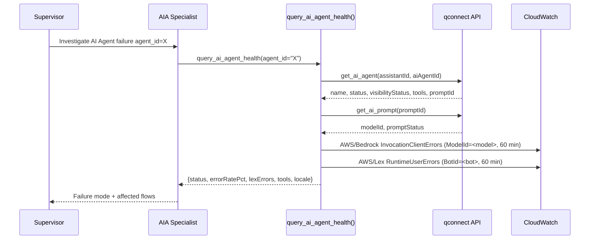
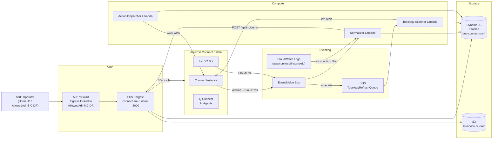

# Amazon Connect SRE Agent — Architecture

This document describes the system architecture at four C4 levels: Context, Containers, Components, and key Code flows.

---

## Level 1 — System Context

Who uses the system and what external systems does it depend on?



---

## Level 2 — Containers

The major deployable units and how they communicate.



### Demo vs Live mode

Every `GET` endpoint accepts `?mode=demo|live`. In demo mode the backend returns hardcoded mock data and never calls AWS APIs. The UI header toggle sets this globally — safe for demonstrations without a populated environment.

---

## Level 3 — Components

### 3.1 Agent Runtime (`runtime/`)



**Strands thread model:** `_BedrockSupervisor.chat()` runs Strands synchronously inside a `ThreadPoolExecutor` so FastAPI's async event loop is never blocked. Strands `@tool` wrappers are applied in `agents_bedrock.py`, not in `tools.py`, preserving provider-agnosticism.

### 3.2 Normalizer Lambda (`infra/src/normalizer.py`)

Handles five distinct event shapes from EventBridge/CloudWatch Logs:

| Trigger | Pattern | Handler |
|---|---|---|
| CloudWatch Alarm | `source=aws.cloudwatch`, `detail-type=CloudWatch Alarm State Change` | `parse_cloudwatch_alarm()` |
| Connect mutation | `source=aws.cloudtrail`, `eventSource=connect.amazonaws.com` | `parse_connect_cloudtrail()` |
| Lex mutation | `source=aws.cloudtrail`, `eventSource=lexv2.amazonaws.com` | `parse_lex_cloudtrail()` |
| Lambda mutation | `source=aws.cloudtrail`, `eventSource=lambda.amazonaws.com` | `parse_lambda_cloudtrail()` |
| Flow log errors | `awslogs` key — CW Logs subscription filter | `parse_contact_flow_log_errors()` |

After parsing: `save_incident()` deduplicates within a 30-minute window (`DEDUPE_WINDOW_MINUTES`) then writes to DynamoDB. Configuration mutations also enqueue a topology refresh via SQS. All incident types call `trigger_agent_investigation()` → `POST /api/incidents`.

**CloudWatch alarm requirement:** alarms must carry Connect resource dimensions (`InstanceId` + `ContactFlowId` or `QueueId`). A bare alarm name without dimensions gives the agent no resource IDs to investigate.

### 3.3 Topology Scanner (`infra/src/topology_scanner.py`)

Crawls Connect APIs for all configured instance IDs and builds an adjacency-list graph in `dev-connect-sre-topology`. Each DynamoDB row is either:

- **`edgeTypeTarget = "METADATA"`** — node attributes (ARN, type, name)
- **`edgeTypeTarget = "DEPENDS_ON#<target>"`** — forward dependency edge
- **`edgeTypeTarget = "REQUIRED_BY#<target>"`** — reverse dependency edge

This enables BFS traversal in both directions, used by `calculate_blast_radius()` (upstream: what depends on a failed node) and `query_topology()` (all edges for a node).

**The table is empty until the scanner runs.** FLOW, MODULE, and IMPACT specialists cannot function without it.

### 3.4 Specialist Agents — tool scoping

| Specialist | Prompt constant | Tools |
|---|---|---|
| **FLOW** | `FLOW_HEALTH_PROMPT` | `query_topology`, `query_connect_metrics`, `query_cloudwatch_flow_logs` |
| **MODULE** | `MODULE_DEPENDENCY_PROMPT` | `query_topology`, `calculate_blast_radius` |
| **QUEUE** | `QUEUE_ROUTING_PROMPT` | `query_topology`, `query_connect_metrics`, `query_connect_ctrs`, `query_contact_lens`, `query_agent_events` |
| **LEXA** | `LEX_BOT_PROMPT` | `query_topology`, `query_lex_bot_health`, `query_connect_metrics` |
| **AIA** | `AI_ASSIST_PROMPT` | `query_topology`, `query_ai_agent_health` |
| **CHANGE** | `CHANGE_CORRELATION_PROMPT` | `query_recent_mutations` |
| **IMPACT** | `CUSTOMER_IMPACT_PROMPT` | `calculate_blast_radius`, `query_topology`, `query_contact_lens`, `query_agent_events` |
| **RUNBOOK** | `RUNBOOK_PROMPT` | `fetch_runbook` |
| **RISK** | `RISK_POLICY_PROMPT` | `calculate_blast_radius`, `query_topology` |
| **VERIFY** | `VERIFICATION_PROMPT` | `query_connect_metrics`, `query_cloudwatch_flow_logs` |
| **Supervisor only** | `SUPERVISOR_STRANDS_INSTRUCTION` | All above + `propose_remediation` |

### 3.5 Connect AI Agent management

Q Connect AI Agents (ORCHESTRATION type) are managed via the `qconnect` boto3 client. IAM actions use the `wisdom:` prefix despite the SDK client name.

```
GET /api/connect/ai-agents        → qconnect.list_ai_agents() + get_ai_prompt() per agent
GET /api/connect/ai-agents/health → CloudWatch AWS/Bedrock + AWS/Lex (60-min window)
```

Health signals: no dedicated Q Connect CloudWatch namespace exists. Proxy metrics:
- **`AWS/Bedrock`**, dimension `ModelId` — `Invocations`, `InvocationClientErrors`, `InvocationLatency`
- **`AWS/Lex`**, dimension `BotId` — `RuntimeRequestCount`, `RuntimeUserErrors`

The AIA specialist uses `query_ai_agent_health()` to pull all three in a single tool call during incident investigation.

---

## Level 4 — Key Code Flows

### Flow A: End-to-end incident investigation



### Flow B: Q Connect AI Agent health check



### Flow C: UI serving (dev vs production)

```
Development
  Browser :5173  →  Vite proxy /api/*  →  FastAPI :8000

Production (Docker)
  Browser :8000  →  FastAPI serves /api/* routes
                 →  FastAPI serves ui/dist/ (StaticFiles)
                 →  /{full_path} catch-all → ui/dist/index.html
```

No Nginx. The Dockerfile two-stage build copies `ui/dist` into the Python container.

---

## Infrastructure overview (AWS)



### CloudFormation template

`infra/cloudformation/connect-sre-agent-platform.yaml` is the primary template. `sre-agent-platform.yaml` at repo root is a compatibility copy — keep both in sync. Provisions: VPC, ALB, ECS Fargate task + service, all Lambda functions, IAM roles, DynamoDB tables, EventBridge rules, SQS queues, and optionally a CloudWatch Logs subscription filter (requires `PrimaryConnectInstanceId` parameter).

Feature flags (CloudFormation parameters, both default `false`):

| Parameter | Effect |
|---|---|
| `EnableConnectWriteActions` | Allows Action Dispatcher to call Connect write APIs |
| `EnableAutonomousActions` | Allows remediations without human approval |

---

## Data model

| Table | PK | SK | Notes |
|---|---|---|---|
| `dev-connect-sre-topology` | `nodeId` | `edgeTypeTarget` | `METADATA` = attrs; `DEPENDS_ON#X` / `REQUIRED_BY#X` = edges |
| `dev-connect-sre-incidents` | `incidentId` | — | GSI on `connectResourceId + createdAt` |
| `dev-connect-sre-approvals` | `approvalId` | — | States: `PENDING → APPROVED / REJECTED / AUTO_APPROVED` |
| `dev-connect-sre-policy-config` | `policyId` | — | Evaluated by `propose_remediation` at tool-call time |
| `dev-connect-sre-agent-runs` | `runId` | — | Trace header per investigation |
| `dev-connect-sre-agent-steps` | `runId` | `stepId` | Fine-grained step trace; TTL 90 days |
| `dev-connect-sre-journey-map` | `journeyId` | — | Customer journey definitions |
| `dev-connect-sre-tool-registry` | `toolId` | — | Tool metadata + enabled flag |
| `dev-connect-sre-memory` | `memoryId` | — | Long-term investigation memory; TTL 180 days |
